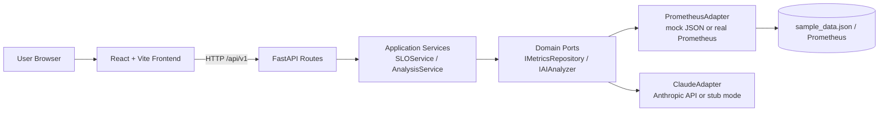
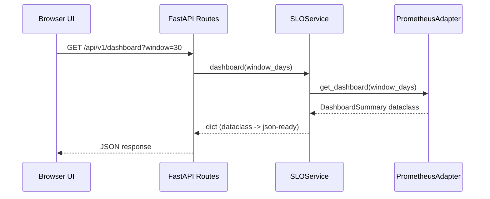
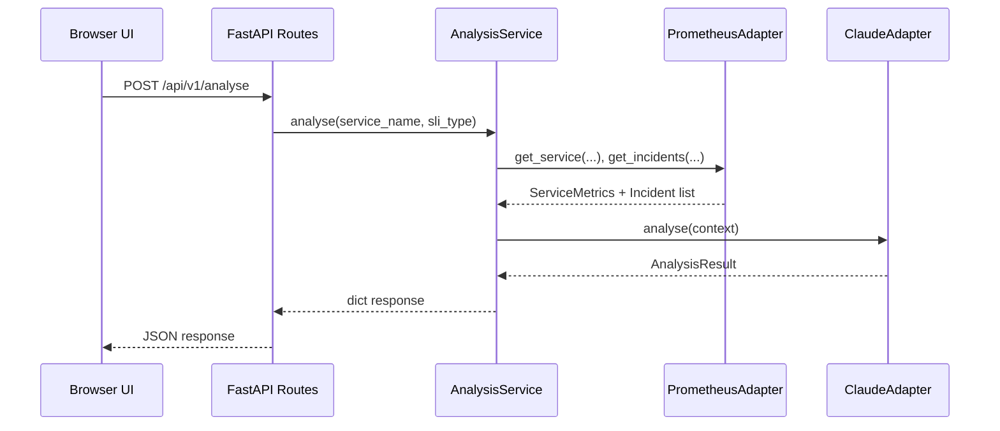

# Sentinel - Reliability Conformance Dashboard

Real-time SLI/SLO/SLA tracking with AI-powered breach analysis.

## Why This Repository Stays Clean

This repository is configured to avoid committing machine-local runtime outputs.

Ignored categories include:
- Python runtime/cache artifacts
- Node/Vite artifacts (`node_modules`, `.vite`, build output)
- Local environment files (`.env`)
- Generated sample data files

If these files were already staged/tracked before `.gitignore` updates, run once:

```bash
git rm -r --cached frontend/node_modules frontend/dist frontend/.vite || true
git rm --cached backend/sample_data.json backend/data/sample_data.json || true
git add .gitignore
git commit -m "chore: stop tracking runtime and generated artifacts"
```

## High-Level Architecture (HLD)

Sentinel uses a clean, modular architecture:

- Backend: Hexagonal Architecture (Ports and Adapters)
- Frontend: Component-driven React SPA with API service abstraction
- Integration style: REST APIs from FastAPI to React



## Backend Architecture Frameworks

- Hexagonal Architecture (Ports and Adapters)
- DDD-lite domain layer using pure dataclasses and enums
- Thin HTTP adapter pattern (FastAPI routes hold no business logic)
- Dependency inversion via interfaces in `domain/ports.py`

Key layers:
- `domain/`: core models and interfaces (framework independent)
- `application/`: orchestration and use-case services
- `adapters/`: concrete implementations for metrics and AI
- `api/`: request/response routing and validation

## Frontend Architecture Frameworks

- React 18 + Vite SPA
- Component-driven UI architecture
- Shared design system in `index.css` (tokens + reusable primitives)
- Service layer abstraction in `src/services/api.js`
- Tab-oriented dashboard modules for reliability personas

Key layers:
- `components/tabs/`: feature screens (Overview, SLO, Error Budget, SLA, Incidents)
- `components/shared/`: reusable UI and modal primitives
- `services/`: backend API client wrappers

## Low-Level Design (LLD)

### Request Flow: Dashboard Data



### Request Flow: AI Analysis



## Data Model

Core backend entities (dataclasses in `backend/src/domain/models.py`):

| Entity | Purpose | Key Fields |
|---|---|---|
| `DashboardSummary` | Top-level dashboard aggregate | `services`, `sla_tiers`, `overall_availability_pct`, status counters |
| `ServiceMetrics` | Per-service reliability state | `avg_availability_pct`, `avg_error_rate_pct`, `avg_latency_p99_ms`, `error_budget`, `slos`, `incidents` |
| `SLO` | Objective contract for an SLI | `target`, `window_days`, `current_compliance`, `status`, `error_budget` |
| `SLI` | Measured indicator values | `current_value`, `target`, `direction`, burn rates, `trend` |
| `ErrorBudget` | Budget accounting over SLO window | `allowed_downtime_minutes`, `consumed_minutes`, `remaining_pct`, `burn_rate_current` |
| `Incident` | Reliability event | severity, timing, impact, root cause |
| `SLATier` | Contractual compliance group | `target_pct`, `actual_pct`, `compliant`, credits |
| `AnalysisResult` | AI output payload | summary, hypotheses, action plans, observability gaps, caveats |

## API Reference

| Method | Path | Description |
|---|---|---|
| GET | `/api/v1/dashboard?window=30` | All services dashboard |
| GET | `/api/v1/services/{name}` | Single service detail |
| GET | `/api/v1/services/{name}/availability?days=30` | Availability time series |
| GET | `/api/v1/services/{name}/budget?days=30` | Error budget burndown |
| GET | `/api/v1/services/{name}/heatmap?days=90` | Daily availability heatmap |
| GET | `/api/v1/sla` | SLA tier obligations |
| GET | `/api/v1/incidents?service=auth_service&limit=50` | Incident log |
| POST | `/api/v1/analyse` | AI breach analysis |
| GET | `/api/v1/health` | Liveness endpoint |

## Advantages

- Adapter swap with minimal blast radius (mock -> real Prometheus, stub AI -> real AI)
- Business logic isolated from frameworks and HTTP concerns
- Clear contracts through ports/interfaces improve testability
- Frontend has explicit service client boundary and modular tabs
- Rich observability vocabulary (SLO, burn rate, error budget, MTTR/MTBF)

## Disadvantages

- Current adapter does in-memory calculations; no persistent state/history DB
- Single API version and minimal auth/rate limiting for production hardening
- AI analysis quality depends on prompt context and external API availability
- Some duplicate generator/adapter artifacts exist and can confuse contributors

## Expected Trade-offs

- Flexibility vs simplicity: ports/adapters add abstractions but reduce coupling
- Demo realism vs operational truth: synthetic data enables demos, but differs from real Prometheus noise/cardinality patterns
- Fast iteration vs strict governance: lightweight structure is productive but needs additional controls for enterprise production (auth, policy, audit)
- Rich UI vs bundle size: charting and modal-heavy UI increases frontend footprint

## Quick Start - Local (No Docker)

### 1) Backend

```bash
cd backend
python3 -m venv .venv
source .venv/bin/activate
pip install -r requirements.txt

# Optional for AI mode; app still runs without API key
cp .env.example .env

# Regenerate local sample data (required if sample_data.json is not present)
python src/data/generator.py

uvicorn src.main:app --reload --port 8000
```

### 2) Frontend (new terminal)

```bash
cd frontend
npm install
npm run dev
```

Frontend: http://localhost:3000  
Backend docs: http://localhost:8000/docs

## Quick Start - Docker

From the `sentinel/` root:

```bash
cat > .env << 'EOF'
ANTHROPIC_API_KEY=
PROMETHEUS_URL=
EOF

docker compose up --build
```

Frontend: http://localhost:3000

## Connecting Real Prometheus

1. Set `PROMETHEUS_URL=http://your-prometheus:9090` in root `.env`.
2. Extend `PrometheusAdapter` to call Prometheus HTTP API (`/api/v1/query_range`) instead of local JSON.
3. Keep `IMetricsRepository` contract unchanged to avoid application/API changes.

## AI Analysis Mode

- `ANTHROPIC_API_KEY` set: calls Claude Sonnet and returns structured analysis.
- `ANTHROPIC_API_KEY` absent: backend returns deterministic stub analysis (demo mode).

## Metrics Glossary

| Term | Definition |
|---|---|
| SLI | Service Level Indicator, measurable signal (availability, latency, error rate) |
| SLO | Service Level Objective, target for an SLI over a window |
| SLA | Contractual commitment; breaches may trigger credits |
| Error Budget | Allowed unreliability before SLO breach |
| Burn Rate | Speed of budget consumption (`1x` = exactly on limit) |
| MTTR | Mean Time To Recover |
| MTBF | Mean Time Between Failures |

## Suggested Next Hardening Steps

- Add backend tests by port contract (domain/application first, adapters second)
- Add auth + rate limiting for API endpoints
- Add OpenTelemetry tracing and structured logs
- Add CI checks for lint, tests, dependency vulnerability scan
